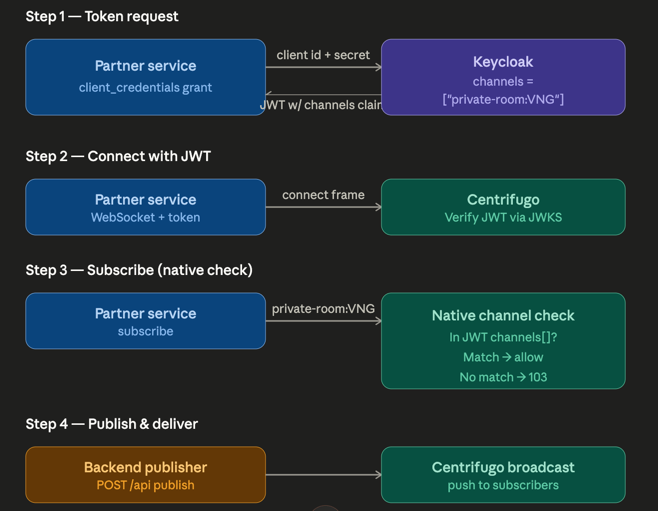
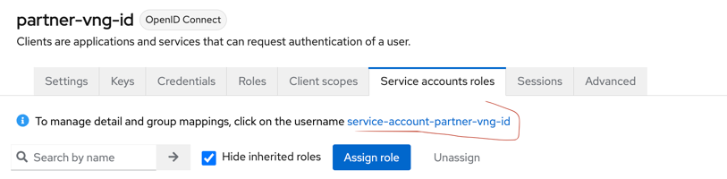
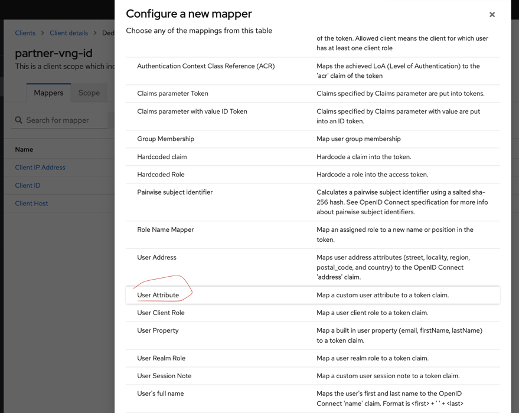
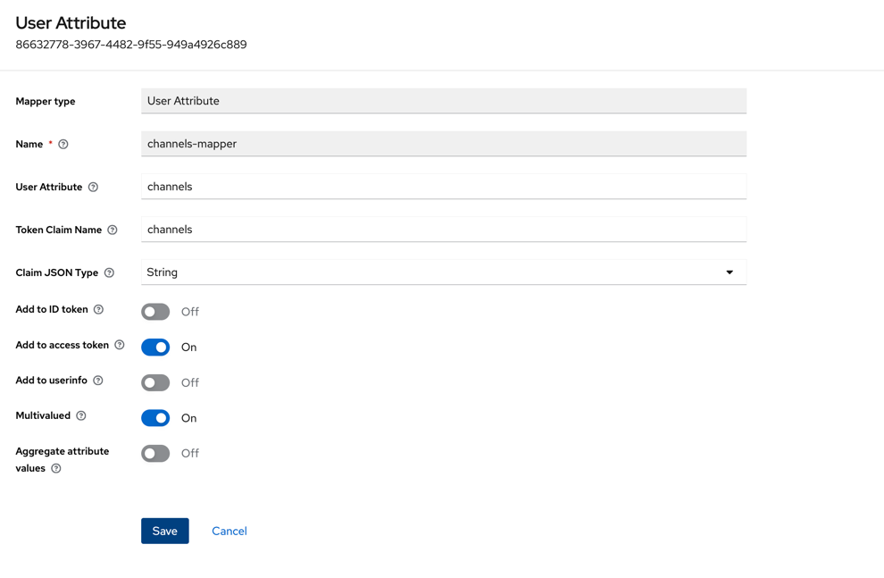
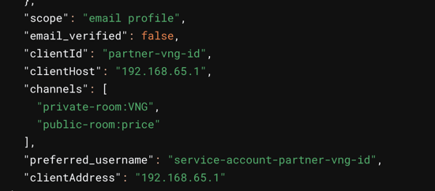
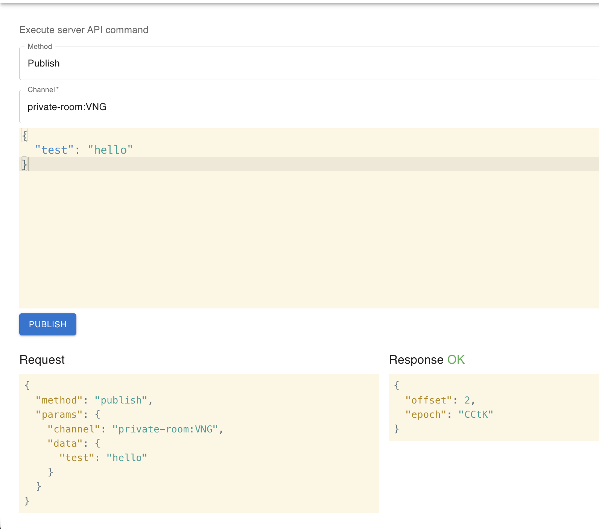

# Architecture



##

```
docker compose up -d

docker compose restart centrifugo
```

## 1. Config keycloak

- Create realm `partner`

### 1.a. Tạo Client

- Client ID: partner-service-vng
- `Client authentication`: On
- Authentication flow: chỉ tick `Service accounts roles` (client credentials grant)

### 1.b. Thêm Attribute với giá trị multi-value



- Vào tab Service accounts roles → click vào service account user (tên dạng service-account-partner-service-vng) → tab Attributes:
- Key: channels
- Value: private-room:VNG (nếu cần nhiều channels, thêm từng dòng: private-room:VNG, public-room:GLOBAL, ...)

Or in new dashboard


### 1.c. Tạo Protocol Mapper
Vào client partner-service-vng → tab Client scopes → click vào partner-service-vng-dedicated → Add mapper → By configuration → chọn User Attribute:

| Field                      | Value                                         |
| -------------------------- | --------------------------------------------- |
| Name                       | `channels-mapper`                             |
| User Attribute             | `channels`                                    |
| Token Claim Name           | `channels`                                    |
| Claim JSON Type            | `String`                                      |
| Add to ID token            | `Off`                                         |
| Add to access token        | `On`                                          |
| Add to userinfo            | `Off`                                         |
| Multivalued                | `On` ← **quan trọng**                         |
| Aggregate attribute values | `On` *(nếu user có nhiều attribute cùng key)* |

- Bật Multivalued = On là điểm mấu chốt — nó sẽ render claim thành JSON array thay vì string.





- JWT payload sẽ thành:
```json
{
  "sub": "service-account-partner-service-vng",
  "iss": "https://localhost:8080/realms/partner",
  "aud": "centrifugo",
  "exp": 1716640000,
  "iat": 1716639100,
  "channels": ["room:VNG"]
}
```

## 2. Get accessToken

```shell
curl -X POST \
  'http://localhost:8080/realms/partner/protocol/openid-connect/token' \
  -H 'Content-Type: application/x-www-form-urlencoded' \
  -d 'grant_type=client_credentials' \
  -d 'client_id=partner-vng-id' \
  -d 'client_secret=AyiUMUN3m2TJ1LstrviFV2qjALHnBZ6Z'
```



## 3. Config centrifugo

```json
{
  "token_jwks_public_endpoint": "http://host.docker.internal:8080/realms/partner/protocol/openid-connect/certs",
  "allowed_origins": ["*"],
  "namespaces": [
    {
      "name": "private-room",
      "presence": true,
      "history_size": 10,
      "history_ttl": "300s",
      "join_leave": true,
      "force_push_join_leave": false
    },
    {
      "name": "public-room",
      "presence": true,
      "history_size": 10,
      "history_ttl": "300s",
      "join_leave": true
    }
  ]
}
```

## 4. Publish event

Go to 
```shell
http://localhost:8000/#/actions
```

Publish mesasge


## 5. Run client


